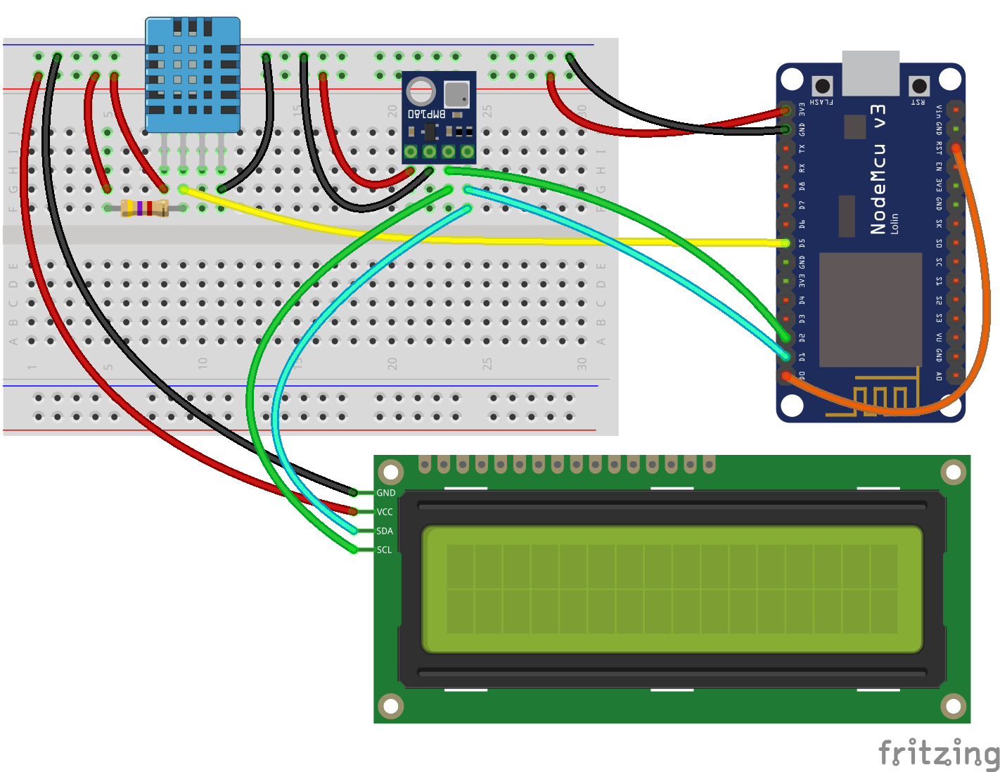

# nodemcu-weather-station
<strong>Estação Meteorológica usando NodeMCU/LUA</strong> 
A Fase 1 do projeto utiliza os sensores BMP180 e DHT11 para obter a temperatura, umidade relativa do ar e pressão atmosférica. Estes dados são enviados para a plataforma de IoT ThingSpeak. Acesse o <a target="_blank" href="http://www.fatecjd.edu.br/estacao/">site do projeto</a> para obter mais informações. 

Material: 

  <ul> 
    <li>NodeMCU V3
    <li>DHT11 (Sensor de Temperatura e Umidade)
    <li>BMP180 (Sensor Barométrico)
    <li>Display de LCD de 16 colunas e 2 linhas com interface i2c
    <li>Resistor de 4,7 kOhms 
    <li>Protoboard
    <li>Cabos para ligação
  </ul>

Diagrama das conexões:

 
